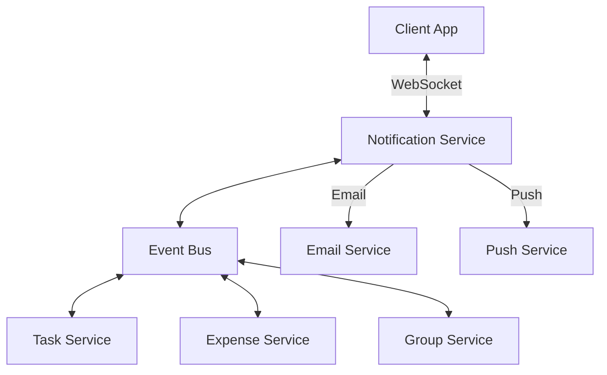

# Roomy API Specification - Complete Integration Guide

## Table of Contents

1. [Overview & Architecture](#overview--architecture)
2. [Authentication System](#authentication-system)
3. [User Management](#user-management)
4. [Group Management](#group-management)
5. [Task Management](#task-management)
6. [Expense Management](#expense-management)
7. [AI Voice Processing](#ai-voice-processing)
8. [Notifications](#notifications)
9. [Flutter Integration Guide](#flutter-integration-guide)
10. [Error Handling](#error-handling)
11. [Best Practices](#best-practices)

---

## Overview & Architecture

### Base Configuration

- **Base URL:** `http://localhost:3000/api/v1`
- **Protocol:** REST with JSON payloads
- **Authentication:** JWT Bearer tokens
- **Content-Type:** `application/json`
- **API Version:** v1 (future-proof versioning)

### Response Format Standard

All API responses follow a consistent structure for predictable frontend integration:

```json
{
  "success": true,
  "message": "Operation completed successfully",
  "data": { /* Response payload */ },
  "timestamp": "2025-07-02T10:30:00Z",
  "version": "1.0"
}
```

### Flutter Integration Architecture

```plaintext
┌─────────────────────┐    ┌─────────────────────┐    ┌─────────────────────┐
│   Flutter App       │    │   Backend API       │    │   Database &        │
│                     │    │                     │    │   External Services │
│ ┌─────────────────┐ │    │ ┌─────────────────┐ │    │                     │
│ │ Presentation    │ │◄──►│ │ Controllers     │ │    │ ┌─────────────────┐ │
│ │ (Widgets/UI)    │ │    │ │ (HTTP Handlers) │ │    │ │ MongoDB         │ │
│ └─────────────────┘ │    │ └─────────────────┘ │    │ │ Collections     │ │
│ ┌─────────────────┐ │    │ ┌─────────────────┐ │    │ └─────────────────┘ │
│ │ Business Logic  │ │    │ │ Services        │ │    │ ┌─────────────────┐ │
│ │ (BLoC/Riverpod) │ │    │ │ (Core Logic)    │ │    │ │ Email Service   │ │
│ └─────────────────┘ │    │ └─────────────────┘ │    │ │ (Notifications) │ │
│ ┌─────────────────┐ │    │ ┌─────────────────┐ │    │ └─────────────────┘ │
│ │ Data Layer      │ │    │ │ Models          │ │    │ ┌─────────────────┐ │
│ │ (Repositories)  │ │    │ │ (Schemas)       │ │    │ │ AI Service      │ │
│ └─────────────────┘ │    │ └─────────────────┘ │    │ │ (Future)        │ │
│ ┌─────────────────┐ │    │ ┌─────────────────┐ │    │ └─────────────────┘ │
│ │ API Client      │ │    │ │ Middleware      │ │    │                     │
│ │ (HTTP/WebSocket)│ │    │ │ (Auth/Security) │ │    │                     │
│ └─────────────────┘ │    │ └─────────────────┘ │    │                     │
└─────────────────────┘    └─────────────────────┘    └─────────────────────┘
```

---

## Authentication System

### Authentication Flow Overview

The API uses a dual-token system with short-lived access tokens and longer-lived refresh tokens for optimal security and user experience.

| Token Type | Lifespan | Purpose | Storage |
|------------|----------|---------|---------|
| Access Token | 15 minutes | API requests | Memory/Secure Storage |
| Refresh Token | 7 days | Token renewal | Flutter Secure Storage |

### 1. User Registration

**Endpoint:** `POST /api/v1/auth/register`

**Purpose:** Create new user accounts with proper validation and security.

**Request:**

```json
{
  "name": "John Doe",
  "email": "john.doe@example.com",
  "password": "SecurePassword123!"
}
```

**Response:**

```json
{
  "success": true,
  "message": "User registered successfully",
  "data": {
    "user": {
      "id": "64f8a1b2c3d4e5f6a7b8c9d0",
      "name": "John Doe",
      "email": "john.doe@example.com",
      "groupId": null,
      "preferences": {
        "notifications": true,
        "voiceEnabled": true,
        "theme": "system"
      }
    },
    "token": "eyJhbGciOiJIUzI1NiIsInR5cCI6IkpXVCJ9...",
    "refreshToken": "eyJhbGciOiJIUzI1NiIsInR5cCI6IkpXVCJ9..."
  }
}
```

**Flutter Integration Tips:**

- Store tokens immediately upon successful registration
- Navigate to group creation/joining flow if `groupId` is null
- Update app theme based on user preferences
- Initialize notification permissions based on user preferences

### 2. User Login

**Endpoint:** `POST /api/v1/auth/login`

**Purpose:** Authenticate existing users and establish session.

**Request:**

```json
{
  "email": "john.doe@example.com", 
  "password": "SecurePassword123!"
}
```

**Flutter Integration Flow:**

```plaintext
User Input → Validation → API Call → Token Storage → Navigation
    ↓              ↓          ↓           ↓            ↓
Email/Pass → Client Check → Send Request → Secure Save → Dashboard/Group
```

### 3. Token Refresh

**Endpoint:** `POST /api/v1/auth/refresh`

**Purpose:** Obtain new access tokens without re-authentication.

**Headers:** `Authorization: Bearer <refresh_token>`

**Flutter Implementation Pattern:**

```dart
// Automatic token refresh in HTTP interceptor
class TokenInterceptor extends Interceptor {
  @override
  void onError(DioError err, ErrorInterceptorHandler handler) {
    if (err.response?.statusCode == 401) {
      // Automatically refresh token and retry request
      refreshTokenAndRetry(err.requestOptions, handler);
    }
  }
}
```

### 4. Profile Management

**Get Profile:** `GET /api/v1/auth/profile`
**Update Profile:** `PUT /api/v1/auth/profile`

**Update Request:**

```json
{
  "name": "Johnny Doe",
  "preferences": {
    "notifications": false,
    "theme": "dark"
  }
}
```

---

## User Management

### Core User Operations

| Operation | Endpoint | Method | Purpose |
|-----------|----------|--------|---------|
| Get Profile | `/auth/profile` | GET | Retrieve current user data |
| Update Profile | `/auth/profile` | PUT | Modify user information |
| Upload Avatar | `/auth/profile/picture` | POST | Set profile picture |
| Delete Avatar | `/auth/profile/picture` | DELETE | Remove profile picture |

### Profile Picture Management

**Upload:** `POST /api/v1/auth/profile/picture`

- **Content-Type:** `multipart/form-data`
- **Field Name:** `profilePicture`
- **Accepted Formats:** JPEG, PNG, WebP
- **Size Limit:** 5MB

**Flutter Implementation:**

```dart
Future<void> uploadProfilePicture(File imageFile) async {
  FormData formData = FormData.fromMap({
    'profilePicture': await MultipartFile.fromFile(
      imageFile.path,
      filename: 'avatar.jpg',
    ),
  });
  
  final response = await dio.post('/auth/profile/picture', data: formData);
  // Handle response and update UI
}
```

---

## Group Management

### Group Lifecycle Overview

```plaintext
User Registration → Group Creation/Joining → Member Management → Collaboration
       ↓                    ↓                      ↓                ↓
   No Group ID → Generate Invite Code → Add/Remove Members → Share Tasks/Expenses
```

### 1. Group Creation

**Endpoint:** `POST /api/v1/groups`

**Purpose:** Create new household groups with the creator as admin.

**Request:**

```json
{
  "name": "Apartment 42B",
  "description": "Downtown apartment roommates",
  "settings": {
    "maxMembers": 6,
    "allowExpenses": true,
    "timezone": "America/New_York"
  }
}
```

**Response:**

```json
{
  "success": true,
  "data": {
    "group": {
      "id": "64f8a1b2c3d4e5f6a7b8c9d1",
      "name": "Apartment 42B", 
      "inviteCode": "APT42B7X",
      "members": [{
        "userId": "64f8a1b2c3d4e5f6a7b8c9d0",
        "role": "admin",
        "joinedAt": "2025-07-02T10:00:00Z"
      }]
    }
  }
}
```

**Flutter Integration:**

- Automatically update user's `groupId` in local storage
- Navigate to group dashboard
- Display invite code prominently for sharing
- Enable group-specific features (tasks, expenses)

### 2. Group Joining

**Endpoint:** `POST /api/v1/groups/join`

**Request:**

```json
{
  "inviteCode": "APT42B7X"
}
```

**Flutter Flow:**

```plaintext
Invite Code Input → Validation → API Call → Success/Error → Group Dashboard
       ↓               ↓          ↓           ↓              ↓
   8-char code → Format check → Join request → Handle result → Load group data
```

### 3. Group Information & Statistics

**Endpoint:** `GET /api/v1/groups/:id`

**Response Includes:**

- Group details and settings
- Member list with roles and join dates
- Activity statistics (tasks, expenses)
- Recent activity summary

**Flutter Dashboard Integration:**

```dart
class GroupDashboard extends StatelessWidget {
  Widget build(BuildContext context) {
    return Column(
      children: [
        GroupHeaderCard(), // Group name, member count
        StatisticsRow(),   // Tasks completed, expenses, etc.
        RecentActivity(),  // Latest tasks/expenses
        QuickActions(),    // Create task, add expense, etc.
      ],
    );
  }
}
```

### 4. Member Management

| Action | Endpoint | Method | Admin Only |
|--------|----------|--------|------------|
| Remove Member | `/groups/:id/members/:userId` | DELETE | Yes |
| Transfer Admin | `/groups/:id/transfer-admin` | PATCH | Yes |
| Update Role | `/groups/:id/members/:userId/role` | PATCH | Yes |
| Leave Group | `/groups/:id/leave` | POST | No |

**Admin Transfer Request:**

```json
{
  "newAdminId": "64f8a1b2c3d4e5f6a7b8c9d3"
}
```

### 5. Invite Management

**Email Invitation:** `POST /api/v1/groups/:id/invite-email`

**Request:**

```json
{
  "email": "friend@example.com",
  "personalMessage": "Join our household group!"
}
```

**Regenerate Code:** `POST /api/v1/groups/:id/regenerate-invite`

---

## Task Management

### Task System Architecture

Tasks are the core collaborative feature, supporting both manual creation and AI-assisted generation.

### Task Data Structure

| Field | Type | Purpose | Required |
|-------|------|---------|----------|
| title | String | Task name | Yes |
| description | String | Detailed information | No |
| assignedTo | ObjectId | Assigned user | No |
| dueDate | Date | Completion deadline | No |
| priority | Enum | low/medium/high | No |
| status | Enum | pending/in_progress/completed | Auto |
| category | Enum | cleaning/cooking/shopping/etc | No |
| aiGenerated | Boolean | Created via voice AI | Auto |

### 1. Task Creation

**Endpoint:** `POST /api/v1/tasks`

**Request:**

```json
{
  "title": "Clean kitchen thoroughly",
  "description": "Deep clean counters, appliances, and floor",
  "assignedTo": "64f8a1b2c3d4e5f6a7b8c9d3",
  "dueDate": "2025-07-03T18:00:00Z",
  "priority": "high",
  "category": "cleaning",
  "estimatedDuration": 45
}
```

**Flutter Form Integration:**

```dart
class TaskCreationForm extends StatefulWidget {
  Widget build(BuildContext context) {
    return Form(
      child: Column(
        children: [
          TextFormField(
            decoration: InputDecoration(labelText: 'Task Title'),
            validator: (value) => value?.isEmpty ?? true 
              ? 'Title is required' : null,
          ),
          DropdownButtonFormField<User>(
            decoration: InputDecoration(labelText: 'Assign To'),
            items: groupMembers.map((user) => 
              DropdownMenuItem(value: user, child: Text(user.name))
            ).toList(),
          ),
          DateTimePicker(
            labelText: 'Due Date',
            onChanged: (date) => setState(() => dueDate = date),
          ),
          // Additional form fields...
        ],
      ),
    );
  }
}
```

### 2. Task Retrieval & Filtering

**Endpoint:** `GET /api/v1/tasks`

**Query Parameters:**

- `status` - Filter by completion status
- `assignedTo` - Filter by assigned user ID (use "me" for current user)
- `category` - Filter by task category
- `dueDate` - Filter by date range
- `priority` - Filter by priority level
- `limit` - Number of results (default: 20)
- `offset` - Pagination offset

**Example:** `GET /api/v1/tasks?status=pending&assignedTo=me&limit=10`

**Flutter Integration Pattern:**

```dart
class TaskRepository {
  Future<List<Task>> getTasks({
    TaskStatus? status,
    String? assignedTo,
    TaskCategory? category,
    int limit = 20,
    int offset = 0,
  }) async {
    final queryParams = <String, dynamic>{
      if (status != null) 'status': status.name,
      if (assignedTo != null) 'assignedTo': assignedTo,
      if (category != null) 'category': category.name,
      'limit': limit,
      'offset': offset,
    };
    
    final response = await apiClient.get('/tasks', queryParameters: queryParams);
    return (response.data['tasks'] as List)
        .map((json) => Task.fromJson(json))
        .toList();
  }
}
```

### 3. Task Completion

**Endpoint:** `PATCH /api/v1/tasks/:id/complete`

**Purpose:** Mark tasks as completed with automatic timestamp and user tracking.

**Response:**

```json
{
  "success": true,
  "data": {
    "task": {
      "id": "64f8a1b2c3d4e5f6a7b8c9d2",
      "status": "completed",
      "completedAt": "2025-07-02T14:30:00Z",
      "completedBy": "64f8a1b2c3d4e5f6a7b8c9d0"
    }
  }
}
```

### 4. Task Notes & Comments

**Add Note:** `POST /api/v1/tasks/:id/notes`

**Request:**

```json
{
  "content": "Kitchen looks great! Extra attention paid to the stove."
}
```

**Flutter Implementation:**

```dart
class TaskDetailPage extends StatelessWidget {
  Widget buildNotesSection(Task task) {
    return Column(
      children: [
        ...task.notes.map((note) => NoteCard(note: note)),
        AddNoteForm(
          onSubmit: (content) => taskRepository.addNote(task.id, content),
        ),
      ],
    );
  }
}
```

### 5. Task Statistics

**Endpoint:** `GET /api/v1/tasks/statistics`

**Purpose:** Retrieve completion rates, workload distribution, and performance metrics.

**Response:**

```json
{
  "success": true,
  "data": {
    "totalTasks": 45,
    "completedTasks": 38,
    "pendingTasks": 7,
    "completionRate": 84.4,
    "memberStats": [
      {
        "userId": "64f8a1b2c3d4e5f6a7b8c9d0",
        "name": "John Doe",
        "assigned": 12,
        "completed": 10,
        "completionRate": 83.3
      }
    ],
    "categoryBreakdown": {
      "cleaning": 15,
      "cooking": 8,
      "shopping": 12
    }
  }
}
```

---

## Expense Management

### Expense System Overview

The expense management system supports equal and custom splitting with automatic balance calculations and settlement tracking.

### Expense Splitting Types

| Split Type | Description | Use Case |
|------------|-------------|----------|
| Equal | Divide equally among all members | Groceries, utilities |
| Custom | Manual amounts per member | Unequal usage scenarios |
| Percentage | Proportional splitting | Income-based splitting |

### 1. Expense Creation

**Endpoint:** `POST /api/v1/expenses`

**Request:**

```json
{
  "amount": 85.50,
  "description": "Weekly groceries - Whole Foods",
  "category": "groceries",
  "receiptUrl": "https://cloudinary.com/receipts/abc123.jpg"
}
```

**Response:**

```json
{
  "success": true,
  "data": {
    "expense": {
      "id": "64f8a1b2c3d4e5f6a7b8c9d6",
      "amount": 85.50,
      "description": "Weekly groceries - Whole Foods",
      "payerId": "64f8a1b2c3d4e5f6a7b8c9d0",
      "payerName": "John Doe",
      "splits": [
        {
          "memberId": "64f8a1b2c3d4e5f6a7b8c9d0",
          "memberName": "John Doe",
          "amount": 28.50,
          "paid": true
        },
        {
          "memberId": "64f8a1b2c3d4e5f6a7b8c9d3", 
          "memberName": "Jane Smith",
          "amount": 28.50,
          "paid": false
        },
        {
          "memberId": "64f8a1b2c3d4e5f6a7b8c9d8",
          "memberName": "Bob Wilson", 
          "amount": 28.50,
          "paid": false
        }
      ],
      "date": "2025-07-02T15:00:00Z"
    }
  }
}
```

**Flutter Integration:**

```dart
class ExpenseCreationFlow extends StatefulWidget {
  Widget build(BuildContext context) {
    return Stepper(
      steps: [
        Step(
          title: Text('Expense Details'),
          content: ExpenseDetailsForm(),
        ),
        Step(
          title: Text('Receipt (Optional)'), 
          content: ReceiptUploadWidget(),
        ),
        Step(
          title: Text('Split Options'),
          content: SplitOptionsWidget(),
        ),
        Step(
          title: Text('Review & Create'),
          content: ExpenseReviewWidget(),
        ),
      ],
    );
  }
}
```

### 2. Custom Split Management

**Set Custom Splits:** `POST /api/v1/expenses/:id/splits/custom`

**Request:**

```json
{
  "splits": [
    {
      "memberId": "64f8a1b2c3d4e5f6a7b8c9d0",
      "amount": 40.00
    },
    {
      "memberId": "64f8a1b2c3d4e5f6a7b8c9d3", 
      "amount": 25.50
    },
    {
      "memberId": "64f8a1b2c3d4e5f6a7b8c9d8",
      "amount": 20.00
    }
  ]
}
```

**Reset to Equal:** `POST /api/v1/expenses/:id/splits/reset`

### 3. Balance Management

**Get Group Balances:** `GET /api/v1/expenses/balances`

**Response:**

```json
{
  "success": true,
  "data": {
    "balances": [
      {
        "memberId": "64f8a1b2c3d4e5f6a7b8c9d0",
        "memberName": "John Doe",
        "totalPaid": 245.50,
        "totalOwed": 189.33,
        "netBalance": 56.17,
        "status": "owed"
      },
      {
        "memberId": "64f8a1b2c3d4e5f6a7b8c9d3",
        "memberName": "Jane Smith", 
        "totalPaid": 120.00,
        "totalOwed": 189.33,
        "netBalance": -69.33,
        "status": "owes"
      }
    ],
    "summary": {
      "totalGroupExpenses": 568.00,
      "averagePerMember": 189.33,
      "fullySettledExpenses": 12,
      "pendingSettlement": 3
    }
  }
}
```

**Flutter Balance Display:**

```dart
class BalanceCard extends StatelessWidget {
  final UserBalance balance;
  
  Widget build(BuildContext context) {
    return Card(
      child: ListTile(
        leading: CircleAvatar(child: Text(balance.memberName[0])),
        title: Text(balance.memberName),
        subtitle: Text('${balance.status == "owes" ? "Owes" : "Is owed"}'),
        trailing: Text(
          '\$${balance.netBalance.abs().toStringAsFixed(2)}',
          style: TextStyle(
            color: balance.status == "owes" ? Colors.red : Colors.green,
            fontWeight: FontWeight.bold,
          ),
        ),
      ),
    );
  }
}
```

### 4. Payment Tracking

**Mark Split as Paid:** `PATCH /api/v1/expenses/:expenseId/splits/:memberId/paid`

**Payment Reminders:** `POST /api/v1/expenses/payment-reminders`

### 5. Expense Statistics

**Endpoint:** `GET /api/v1/expenses/statistics`

**Query Parameters:**

- `period` - time, last30days, last3months, lastyear
- `category` - Filter by expense category
- `member` - Filter by specific member

**Response:**

```json
{
  "data": {
    "totalExpenses": 1250.75,
    "expenseCount": 25,
    "averageExpense": 50.03,
    "categoryBreakdown": {
      "groceries": 450.00,
      "utilities": 300.00,
      "rent": 500.75
    },
    "monthlyTrend": [
      {"month": "2025-05", "amount": 420.50},
      {"month": "2025-06", "amount": 380.25},
      {"month": "2025-07", "amount": 450.00}
    ],
    "topExpenses": [
      {
        "id": "64f8a1b2c3d4e5f6a7b8c9d6",
        "description": "Monthly rent payment",
        "amount": 500.75,
        "date": "2025-07-01T00:00:00Z"
      }
    ]
  }
}
```

---

## AI Voice & Text Processing

### Overview

The AI system enables natural language task creation and management using Google's Gemini 2.0 Flash model. It supports both voice and text input with context-aware processing.

### Key Features

- Natural language understanding for task creation
- Context-aware processing using group data
- Member mention detection and assignment
- Confidence scoring for suggestions
- Fallback system for AI unavailability

### API Endpoints

#### 1. Process Voice/Text Input

**Endpoint:** `POST /api/v1/ai/process`

**Purpose:** Process natural language input and extract structured task data.

**Request:**
```json
{
  "text": "Ask John to buy milk tomorrow at 5pm",
  "groupId": "60d5ecb8f8b1a6b5d8f4e3c2",
  "context": {
    "previousMessages": [],
    "userPreferences": {}
  }
}
```

**Response:**
```json
{
  "success": true,
  "data": {
    "suggestedTasks": [
      {
        "title": "Buy milk",
        "description": "",
        "assignedTo": "60d5ecb8f8b1a6b5d8f4e3c1",
        "dueDate": "2025-07-08T17:00:00.000Z",
        "priority": "medium",
        "confidence": 0.92
      }
    ],
    "memberMentions": [
      {
        "userId": "60d5ecb8f8b1a6b5d8f4e3c1",
        "name": "John",
        "confidence": 0.96
      }
    ],
    "metadata": {
      "model": "gemini-2.0-flash-exp",
      "processingTime": 1200
    }
  }
}
```

#### 2. Confirm and Create Tasks

**Endpoint:** `POST /api/v1/ai/confirm-tasks`

**Purpose:** Create tasks from AI suggestions after user confirmation.

**Request:**
```json
{
  "tasks": [
    {
      "title": "Buy milk",
      "assignedTo": "60d5ecb8f8b1a6b5d8f4e3c1",
      "dueDate": "2025-07-08T17:00:00.000Z",
      "priority": "medium"
    }
  ],
  "originalText": "Ask John to buy milk tomorrow at 5pm",
  "groupId": "60d5ecb8f8b1a6b5d8f4e3c2"
}
```

### Flutter Integration

#### AI Service Wrapper

```dart
class AIService {
  final Dio _dio;
  
  AIService({Dio? dio}) : _dio = dio ?? Dio();
  
  Future<AIProcessResponse> processInput({
    required String text,
    required String groupId,
    Map<String, dynamic>? context,
  }) async {
    try {
      final response = await _dio.post(
        '/ai/process',
        data: {
          'text': text,
          'groupId': groupId,
          'context': context ?? {},
        },
      );
      return AIProcessResponse.fromJson(response.data);
    } on DioException catch (e) {
      throw _handleError(e);
    }
  }
  
  // ... other methods
}
```

#### AI Task Creation Widget

```dart
class AITaskInput extends StatefulWidget {
  final String groupId;
  
  const AITaskInput({Key? key, required this.groupId}) : super(key: key);

  @override
  _AITaskInputState createState() => _AITaskInputState();
}

class _AITaskInputState extends State<AITaskInput> {
  final _aiService = AIService();
  final _textController = TextEditingController();
  bool _isProcessing = false;
  
  Future<void> _processInput() async {
    if (_textController.text.trim().isEmpty) return;
    
    setState(() => _isProcessing = true);
    
    try {
      final response = await _aiService.processInput(
        text: _textController.text,
        groupId: widget.groupId,
      );
      
      if (mounted) {
        await _showTaskPreview(response);
      }
    } catch (e) {
      if (mounted) {
        ScaffoldMessenger.of(context).showSnackBar(
          SnackBar(content: Text('Failed to process input: ${e.toString()}')),
        );
      }
    } finally {
      if (mounted) {
        setState(() => _isProcessing = false);
      }
    }
  }
  
  // ... rest of the implementation
}
```

### Error Handling

| Error Code | Description | Suggested Action |
|------------|-------------|------------------|
| 400 | Invalid input or missing parameters | Validate user input and retry |
| 401 | Unauthorized | Refresh token or re-authenticate |
| 429 | Rate limit exceeded | Implement exponential backoff |
| 503 | AI service unavailable | Show fallback UI or try later |

### Best Practices

1. **Progressive Enhancement**
   - Always provide a fallback for when AI features are unavailable
   - Show confidence scores to set user expectations
   - Allow manual override of AI suggestions

2. **Performance**
   - Implement request debouncing for text input
   - Cache common queries
   - Show loading indicators for AI operations

3. **User Experience**
   - Provide clear feedback during processing
   - Show preview before creating tasks
   - Allow easy editing of AI suggestions

---

## Real-Time Notifications System

Roomy's notification system provides real-time updates through WebSockets while maintaining email notifications for important events. The system is designed for reliability, performance, and a seamless user experience.

### Architecture Overview



### WebSocket Connection

#### Connection Management

```dart
class NotificationService {
  static final NotificationService _instance = NotificationService._internal();
  WebSocketChannel? _socket;
  final _notificationController = StreamController<Notification>.broadcast();
  final _reconnectDelay = const Duration(seconds: 1);
  Timer? _reconnectTimer;
  bool _isConnected = false;
  
  Stream<Notification> get notifications => _notificationController.stream;
  bool get isConnected => _isConnected;
  
  NotificationService._internal() {
    _connect();
  }
  
  Future<void> _connect() async {
    try {
      final token = await _getAuthToken();
      _socket = WebSocketChannel.connect(
        Uri.parse('wss://api.roomy.app/ws/notifications'),
        headers: {'Authorization': 'Bearer $token'},
      );
      
      _socket!.stream.listen(
        _handleIncomingMessage,
        onError: _handleError,
        onDone: _handleDisconnect,
        cancelOnError: true,
      );
      
      _isConnected = true;
      _resetReconnectTimer();
      _scheduleHeartbeat();
      
    } catch (e) {
      _scheduleReconnect();
    }
  }
  
  void _handleIncomingMessage(dynamic message) {
    try {
      final notification = Notification.fromJson(
        jsonDecode(utf8.decode(message as List<int>)),
      );
      _notificationController.add(notification);
      _handleNotification(notification);
    } catch (e) {
      _logError('Error processing message: $e');
    }
  }
  
  // ... other methods ...
}
```

### Notification Types & Payloads

#### Real-Time Events

| Event Type | Payload | Description |
|------------|---------|-------------|
| `task_created` | `{ task: Task, groupId: string }` | New task created in group |
| `task_updated` | `{ task: Task, updates: object }` | Task details updated |
| `task_completed` | `{ taskId: string, completedBy: string }` | Task marked as complete |
| `expense_added` | `{ expense: Expense, groupId: string }` | New expense added |
| `expense_updated` | `{ expenseId: string, updates: object }` | Expense details updated |
| `expense_deleted` | `{ expenseId: string, groupId: string }` | Expense removed |
| `group_updated` | `{ group: Group, updates: object }` | Group details changed |
| `member_joined` | `{ user: User, groupId: string }` | New member joined group |
| `member_left` | `{ userId: string, groupId: string }` | Member left the group |
| `role_changed` | `{ userId: string, groupId: string, newRole: string }` | Member role changed |
| `payment_received` | `{ fromUserId: string, toUserId: string, amount: number, groupId: string }` | Payment recorded |

#### Email Notifications

| Event Type | Trigger | Recipients | Template |
|------------|---------|------------|----------|
| Task Assigned | User assigned to task | Assignee | Task details, due date |
| Task Due Soon | 24h before due time | Assignee | Task details, due time |
| Task Overdue | After due time | Assignee | Task details, overdue notice |
| Task Reminder | Custom reminder time | Assignee | Task reminder details |
| Expense Added | New expense in group | Group members | Expense details, split amounts |
| Expense Updated | Expense modified | Affected members | Updated expense details |
| Group Invite | New member invited | Invited user | Inviter details, group info |
| Payment Request | Manual payment request | Owing user | Amount, creditor, due date |
| Payment Reminder | Automatic reminder | Owing user | Amount, creditor, due date |
| Payment Received | Payment recorded | Payer & Payee | Payment confirmation |
| Weekly Summary | Weekly digest | Users with activity | Summary of group activity |

### Notification Preferences

Users can customize their notification preferences through the app settings:

```dart
class NotificationPreferences {
  bool pushEnabled;
  bool emailEnabled;
  Map<NotificationType, NotificationChannel> channelPreferences;
  
  // Per-channel preferences
  bool getPushEnabled(NotificationType type) => 
      channelPreferences[type]?.push ?? pushEnabled;
      
  bool getEmailEnabled(NotificationType type) => 
      channelPreferences[type]?.email ?? emailEnabled;
}

enum NotificationType {
  taskAssigned,
  taskDueSoon,
  taskOverdue,
  taskReminder,
  expenseAdded,
  expenseUpdated,
  groupInvite,
  paymentRequest,
  paymentReminder,
  paymentReceived,
  weeklySummary,
}
```

### API Endpoints

| Method | Endpoint | Description |
|--------|----------|-------------|
| `GET` | `/api/v1/notifications` | Get user notifications |
| `POST` | `/api/v1/notifications/mark-read` | Mark notifications as read |
| `DELETE` | `/api/v1/notifications/:id` | Delete a notification |
| `GET` | `/api/v1/notifications/preferences` | Get notification preferences |
| `PUT` | `/api/v1/notifications/preferences` | Update preferences |
| `POST` | `/api/v1/notifications/test` | Send test notification |

### Flutter Integration

#### Notification Service

```dart
class NotificationHandler {
  final NotificationService _notificationService;
  final LocalNotificationService _localNotification;
  final NavigationService _navigationService;
  
  NotificationHandler(
    this._notificationService,
    this._localNotification,
    this._navigationService,
  ) {
    _setupNotificationHandlers();
  }
  
  void _setupNotificationHandlers() {
    _notificationService.notifications.listen((notification) async {
      // Check user preferences
      final prefs = await _getUserPreferences();
      
      // Show in-app notification
      if (prefs.getPushEnabled(notification.type)) {
        await _showLocalNotification(notification);
      }
      
      // Update UI based on notification type
      _handleNotification(notification);
    });
  }
  
  Future<void> _showLocalNotification(Notification notification) async {
    await _localNotification.show(
      id: notification.id.hashCode,
      title: notification.title,
      body: notification.body,
      payload: jsonEncode(notification.toJson()),
    );
  }
  
  void _handleNotification(Notification notification) {
    switch (notification.type) {
      case NotificationType.taskAssigned:
      case NotificationType.taskDueSoon:
      case NotificationType.taskOverdue:
        _handleTaskNotification(notification);
        break;
      case NotificationType.expenseAdded:
      case NotificationType.expenseUpdated:
        _handleExpenseNotification(notification);
        break;
      // ... other handlers
    }
  }
  
  // ... other methods
}
```

#### Error Handling & Reconnection

```dart
class NotificationService {
  // ... existing code ...
  
  void _handleError(dynamic error) {
    _logError('WebSocket error: $error');
    _isConnected = false;
    _scheduleReconnect();
  }
  
  void _handleDisconnect() {
    _isConnected = false;
    _scheduleReconnect();
  }
  
  void _scheduleReconnect() {
    _reconnectTimer?.cancel();
    _reconnectTimer = Timer(_reconnectDelay, () {
      if (!_isConnected) {
        _connect();
      }
    });
  }
  
  void _resetReconnectTimer() {
    _reconnectDelay = const Duration(seconds: 1);
  }
  
  void _scheduleHeartbeat() {
    Timer.periodic(const Duration(seconds: 30), (timer) {
      if (_isConnected) {
        _socket?.sink.add(jsonEncode({'type': 'heartbeat'}));
      } else {
        timer.cancel();
      }
    });
  }
  
  // ... other methods ...
}
```

### Best Practices

1. **Connection Management**
   - Implement exponential backoff for reconnection
   - Handle network changes gracefully
   - Show connection status in the UI
   - Use ping/pong for connection health

2. **Performance**
   - Batch notifications when possible
   - Debounce rapid updates
   - Use efficient serialization (MessagePack/Protocol Buffers)
   
3. **User Experience**
   - Group related notifications
   - Provide clear actions
   - Respect user preferences
   - Support notification channels (Android)
   - Handle notification taps appropriately

4. **Testing**
   - Test different network conditions
   - Verify notification delivery
   - Test edge cases (timezone changes, DST, etc.)
   - Verify proper cleanup on logout

---

## Flutter Integration Guide

### Application Architecture

Based on the SRS document, the Flutter app follows Clean Architecture principles:

```plaintext
lib/
├── core/
│   ├── constants/
│   ├── errors/
│   ├── network/
│   ├── theme/
│   └── utils/
├── features/
│   ├── authentication/
│   │   ├── data/
│   │   │   ├── datasources/     # API clients
│   │   │   ├── models/          # JSON models
│   │   │   └── repositories/    # Repository implementations
│   │   ├── domain/
│   │   │   ├── entities/        # Business entities
│   │   │   ├── repositories/    # Repository contracts
│   │   │   └── usecases/        # Business logic
│   │   └── presentation/
│   │       ├── bloc/            # State management
│   │       ├── pages/           # Screen widgets
│   │       └── widgets/         # Reusable components
│   ├── tasks/
│   ├── groups/
│   ├── expenses/
│   ├── calendar/
│   └── voice_assistant/
└── shared/
    ├── widgets/
    ├── services/
    └── models/
```

### State Management Integration

**Recommended State Management:** Riverpod 2.4+ for dependency injection and reactive state management.

```dart
// Example: Task state management
final taskRepositoryProvider = Provider<TaskRepository>((ref) {
  final apiClient = ref.read(apiClientProvider);
  return TaskRepository(apiClient);
});

final tasksProvider = StateNotifierProvider<TasksNotifier, TasksState>((ref) {
  final repository = ref.read(taskRepositoryProvider);
  return TasksNotifier(repository);
});

class TasksNotifier extends StateNotifier<TasksState> {
  final TaskRepository _repository;
  
  TasksNotifier(this._repository) : super(TasksState.initial());
  
  Future<void> loadTasks({TaskFilter? filter}) async {
    state = state.copyWith(isLoading: true);
    try {
      final tasks = await _repository.getTasks(filter: filter);
      state = state.copyWith(
        tasks: tasks,
        isLoading: false,
        error: null,
      );
    } catch (error) {
      state = state.copyWith(
        isLoading: false,
        error: error.toString(),
      );
    }
  }
}
```

### API Client Implementation

**Recommended HTTP Client:** Dio 5.3+ with interceptors for authentication and error handling.

```dart
class ApiClient {
  late final Dio _dio;
  
  ApiClient() {
    _dio = Dio(BaseOptions(
      baseUrl: 'http://localhost:3000/api/v1',
      connectTimeout: Duration(seconds: 5),
      receiveTimeout: Duration(seconds: 10),
      headers: {'Content-Type': 'application/json'},
    ));
    
    _dio.interceptors.addAll([
      AuthInterceptor(),
      ErrorInterceptor(),
      LoggingInterceptor(),
    ]);
  }
}

class AuthInterceptor extends Interceptor {
  @override
  void onRequest(RequestOptions options, RequestInterceptorHandler handler) async {
    final token = await SecureStorage.getAccessToken();
    if (token != null) {
      options.headers['Authorization'] = 'Bearer $token';
    }
    handler.next(options);
  }
  
  @override
  void onError(DioError err, ErrorInterceptorHandler handler) async {
    if (err.response?.statusCode == 401) {
      // Attempt token refresh
      final refreshed = await _refreshToken();
      if (refreshed) {
        // Retry original request
        final response = await _dio.fetch(err.requestOptions);
        handler.resolve(response);
        return;
      }
    }
    handler.next(err);
  }
}
```

### Data Flow Patterns

**Repository Pattern Implementation:**

```dart
abstract class TaskRepository {
  Future<List<Task>> getTasks({TaskFilter? filter});
  Future<Task> createTask(CreateTaskRequest request);
  Future<Task> updateTask(String taskId, UpdateTaskRequest request);
  Future<void> completeTask(String taskId);
  Future<void> deleteTask(String taskId);
}

class TaskRepositoryImpl implements TaskRepository {
  final ApiClient _apiClient;
  
  TaskRepositoryImpl(this._apiClient);
  
  @override
  Future<List<Task>> getTasks({TaskFilter? filter}) async {
    final response = await _apiClient.get('/tasks', queryParameters: filter?.toJson());
    final tasksJson = response.data['data']['tasks'] as List;
    return tasksJson.map((json) => Task.fromJson(json)).toList();
  }
  
  @override
  Future<Task> createTask(CreateTaskRequest request) async {
    final response = await _apiClient.post('/tasks', data: request.toJson());
    return Task.fromJson(response.data['data']['task']);
  }
}
```

### Screen Navigation Flow

**Recommended Router:** GoRouter 12.0+ for declarative routing.

```dart
final routerProvider = Provider<GoRouter>((ref) {
  final authState = ref.watch(authStateProvider);
  
  return GoRouter(
    initialLocation: authState.isAuthenticated ? '/dashboard' : '/login',
    redirect: (context, state) {
      final isAuthenticated = authState.isAuthenticated;
      final isOnAuthPage = state.location.startsWith('/auth');
      
      if (!isAuthenticated && !isOnAuthPage) return '/auth/login';
      if (isAuthenticated && isOnAuthPage) return '/dashboard';
      
      return null;
    },
    routes: [
      GoRoute(
        path: '/auth/login',
        builder: (context, state) => LoginScreen(),
      ),
      GoRoute(
        path: '/dashboard',
        builder: (context, state) => DashboardScreen(),
      ),
      GoRoute(
        path: '/tasks',
        builder: (context, state) => TaskListScreen(),
        routes: [
          GoRoute(
            path: '/create',
            builder: (context, state) => TaskCreationScreen(),
          ),
          GoRoute(
            path: '/:taskId',
            builder: (context, state) => TaskDetailScreen(
              taskId: state.params['taskId']!,
            ),
          ),
        ],
      ),
    ],
  );
});
```

### Error Handling Strategy

**Centralized Error Handling:**

```dart
class ApiException implements Exception {
  final String message;
  final int? statusCode;
  final String? errorCode;
  
  ApiException(this.message, {this.statusCode, this.errorCode});
  
  factory ApiException.fromResponse(Response response) {
    final data = response.data;
    return ApiException(
      data['error']['message'] ?? 'Unknown error occurred',
      statusCode: response.statusCode,
      errorCode: data['error']['code'],
    );
  }
}

class ErrorInterceptor extends Interceptor {
  @override
  void onError(DioError err, ErrorInterceptorHandler handler) {
    ApiException apiException;
    
    if (err.response != null) {
      apiException = ApiException.fromResponse(err.response!);
    } else {
      apiException = ApiException('Network error occurred');
    }
    
    handler.next(DioError(
      requestOptions: err.requestOptions,
      error: apiException,
    ));
  }
}
```

### Local Storage Integration

**Secure Storage for Sensitive Data:**

```dart
class SecureStorage {
  static const _storage = FlutterSecureStorage();
  
  static Future<void> storeTokens({
    required String accessToken,
    required String refreshToken,
  }) async {
    await Future.wait([
      _storage.write(key: 'access_token', value: accessToken),
      _storage.write(key: 'refresh_token', value: refreshToken),
    ]);
  }
  
  static Future<String?> getAccessToken() async {
    return await _storage.read(key: 'access_token');
  }
  
  static Future<void> clearTokens() async {
    await Future.wait([
      _storage.delete(key: 'access_token'),
      _storage.delete(key: 'refresh_token'),
    ]);
  }
}
```

**Local Database for Offline Support:**

```dart
class LocalDatabase {
  static late Box<Task> _taskBox;
  static late Box<Expense> _expenseBox;
  
  static Future<void> init() async {
    await Hive.initFlutter();
    Hive.registerAdapter(TaskAdapter());
    Hive.registerAdapter(ExpenseAdapter());
    
    _taskBox = await Hive.openBox<Task>('tasks');
    _expenseBox = await Hive.openBox<Expense>('expenses');
  }
  
  static Future<void> cacheTasks(List<Task> tasks) async {
    await _taskBox.clear();
    await _taskBox.addAll(tasks);
  }
  
  static List<Task> getCachedTasks() {
    return _taskBox.values.toList();
  }
}
```

---

## Error Handling

### Standardized Error Response Format

All API errors follow a consistent structure for predictable frontend handling:

```json
{
  "success": false,
  "error": {
    "code": "VALIDATION_ERROR",
    "message": "Invalid input data provided",
    "details": [
      {
        "field": "email",
        "message": "Email format is invalid"
      },
      {
        "field": "password", 
        "message": "Password must be at least 8 characters"
      }
    ]
  },
  "timestamp": "2025-07-02T11:30:00Z"
}
```

### HTTP Status Codes

| Status Code | Error Type | Description | Flutter Handling |
|-------------|------------|-------------|------------------|
| 400 | Bad Request | Invalid request data | Show validation errors |
| 401 | Unauthorized | Invalid/expired token | Redirect to login |
| 403 | Forbidden | Insufficient permissions | Show permission error |
| 404 | Not Found | Resource doesn't exist | Show not found message |
| 409 | Conflict | Resource conflict | Show conflict resolution |
| 422 | Unprocessable Entity | Validation failed | Show field-specific errors |
| 429 | Rate Limited | Too many requests | Show retry message |
| 500 | Internal Error | Server error | Show generic error message |
| 503 | Service Unavailable | External service down | Show service unavailable |

### Error Categories and Handling

**Validation Errors (400, 422):**

```dart
class ValidationErrorHandler {
  static void handleValidationError(ApiException error) {
    if (error.errorCode == 'VALIDATION_ERROR') {
      final details = error.details;
      for (final detail in details) {
        // Show field-specific error in form
        FormValidator.setFieldError(detail.field, detail.message);
      }
    }
  }
}
```

**Authentication Errors (401):**

```dart
class AuthErrorHandler {
  static Future<void> handleAuthError(ApiException error) async {
    if (error.statusCode == 401) {
      // Clear stored tokens
      await SecureStorage.clearTokens();
      
      // Navigate to login
      GoRouter.of(context).go('/auth/login');
      
      // Show message
      ScaffoldMessenger.of(context).showSnackBar(
        SnackBar(content: Text('Session expired. Please login again.')),
      );
    }
  }
}
```

**Network Errors:**

```dart
class NetworkErrorHandler {
  static void handleNetworkError(DioError error) {
    String message;
    
    switch (error.type) {
      case DioErrorType.connectTimeout:
        message = 'Connection timeout. Please check your internet.';
        break;
      case DioErrorType.receiveTimeout:
        message = 'Server response timeout. Please try again.';
        break;
      case DioErrorType.other:
        message = 'Network error. Please check your connection.';
        break;
      default:
        message = 'An unexpected error occurred.';
    }
    
    ScaffoldMessenger.of(context).showSnackBar(
      SnackBar(content: Text(message)),
    );
  }
}
```

---

## Best Practices

### API Integration Best Practices

**1. Token Management:**

```dart
class TokenManager {
  static const int TOKEN_REFRESH_THRESHOLD = 5 * 60; // 5 minutes
  
  static Future<bool> shouldRefreshToken() async {
    final token = await SecureStorage.getAccessToken();
    if (token == null) return false;
    
    final payload = JwtDecoder.decode(token);
    final expirationTime = payload['exp'] * 1000;
    final currentTime = DateTime.now().millisecondsSinceEpoch;
    
    return (expirationTime - currentTime) < TOKEN_REFRESH_THRESHOLD * 1000;
  }
}
```

**2. Optimistic Updates:**

```dart
class TasksNotifier extends StateNotifier<TasksState> {
  Future<void> completeTask(String taskId) async {
    // Optimistic update
    final updatedTasks = state.tasks.map((task) {
      if (task.id == taskId) {
        return task.copyWith(
          status: TaskStatus.completed,
          completedAt: DateTime.now(),
        );
      }
      return task;
    }).toList();
    
    state = state.copyWith(tasks: updatedTasks);
    
    try {
      // API call
      await _repository.completeTask(taskId);
    } catch (error) {
      // Revert on error
      await loadTasks();
      throw error;
    }
  }
}
```

**3. Pagination Implementation:**

```dart
class PaginatedList<T> {
  final List<T> items;
  final bool hasMore;
  final bool isLoading;
  final int page;
  
  Future<void> loadMore() async {
    if (!hasMore || isLoading) return;
    
    try {
      final newItems = await repository.getItems(
        page: page + 1,
        limit: 20,
      );
      
      state = state.copyWith(
        items: [...items, ...newItems],
        page: page + 1,
        hasMore: newItems.length == 20,
      );
    } catch (error) {
      // Handle error
    }
  }
}
```

**4. Offline Support Strategy:**

```dart
class OfflineFirstRepository {
  Future<List<Task>> getTasks() async {
    try {
      // Try API first
      final tasks = await _apiClient.getTasks();
      await _localDb.cacheTasks(tasks);
      return tasks;
    } catch (error) {
      // Fall back to cached data
      final cachedTasks = await _localDb.getCachedTasks();
      if (cachedTasks.isNotEmpty) {
        return cachedTasks;
      }
      throw error;
    }
  }
  
  Future<Task> createTask(CreateTaskRequest request) async {
    // Create optimistic local task
    final optimisticTask = Task.optimistic(request);
    await _localDb.addTask(optimisticTask);
    
    try {
      // Sync with API
      final createdTask = await _apiClient.createTask(request);
      await _localDb.updateTask(optimisticTask.id, createdTask);
      return createdTask;
    } catch (error) {
      // Mark as pending sync
      await _localDb.markForSync(optimisticTask.id);
      throw error;
    }
  }
}
```

**5. Real-time Updates Integration:**

```dart
class RealTimeService {
  late WebSocketChannel _channel;
  final StreamController<NotificationEvent> _eventController = StreamController.broadcast();
  
  Stream<NotificationEvent> get events => _eventController.stream;
  
  void connect() {
    _channel = WebSocketChannel.connect(
      Uri.parse('ws://localhost:3000/notifications'),
      headers: {'Authorization': 'Bearer ${TokenManager.accessToken}'},
    );
    
    _channel.stream.listen(
      (data) {
        final event = NotificationEvent.fromJson(json.decode(data));
        _eventController.add(event);
      },
      onError: (error) => _handleConnectionError(error),
      onDone: () => _handleConnectionClosed(),
    );
  }
  
  void _handleConnectionError(dynamic error) {
    // Implement exponential backoff reconnection
    Timer(Duration(seconds: math.pow(2, _reconnectAttempts).toInt()), connect);
  }
}
```

### Performance Optimization Tips

**1. Image Loading and Caching:**

```dart
class OptimizedImageWidget extends StatelessWidget {
  final String imageUrl;
  
  Widget build(BuildContext context) {
    return CachedNetworkImage(
      imageUrl: imageUrl,
      placeholder: (context, url) => Shimmer.fromColors(
        baseColor: Colors.grey[300]!,
        highlightColor: Colors.grey[100]!,
        child: Container(height: 200, color: Colors.white),
      ),
      errorWidget: (context, url, error) => Icon(Icons.error),
      memCacheHeight: 300, // Optimize memory usage
      maxHeightDiskCache: 600, // Optimize disk cache
    );
  }
}
```

**2. List Performance:**

```dart
class OptimizedTaskList extends StatelessWidget {
  final List<Task> tasks;
  
  Widget build(BuildContext context) {
    return ListView.builder(
      itemCount: tasks.length,
      itemBuilder: (context, index) {
        return TaskCard(
          key: ValueKey(tasks[index].id), // Stable keys for performance
          task: tasks[index],
        );
      },
      // Use item extent for better performance with fixed-height items
      itemExtent: 120.0,
    );
  }
}
```

**3. State Management Optimization:**

```dart
final filteredTasksProvider = Provider.family<List<Task>, TaskFilter>((ref, filter) {
  final allTasks = ref.watch(tasksProvider).tasks;
  
  // Efficient filtering with memoization
  return allTasks.where((task) {
    if (filter.status != null && task.status != filter.status) return false;
    if (filter.assignedTo != null && task.assignedTo != filter.assignedTo) return false;
    if (filter.category != null && task.category != filter.category) return false;
    return true;
  }).toList();
});
```

This comprehensive API specification provides all the necessary information for smooth Flutter integration with the Roomy backend. The combination of detailed endpoint documentation, practical integration examples, and architectural guidance should enable efficient development and maintenance of the mobile application.
